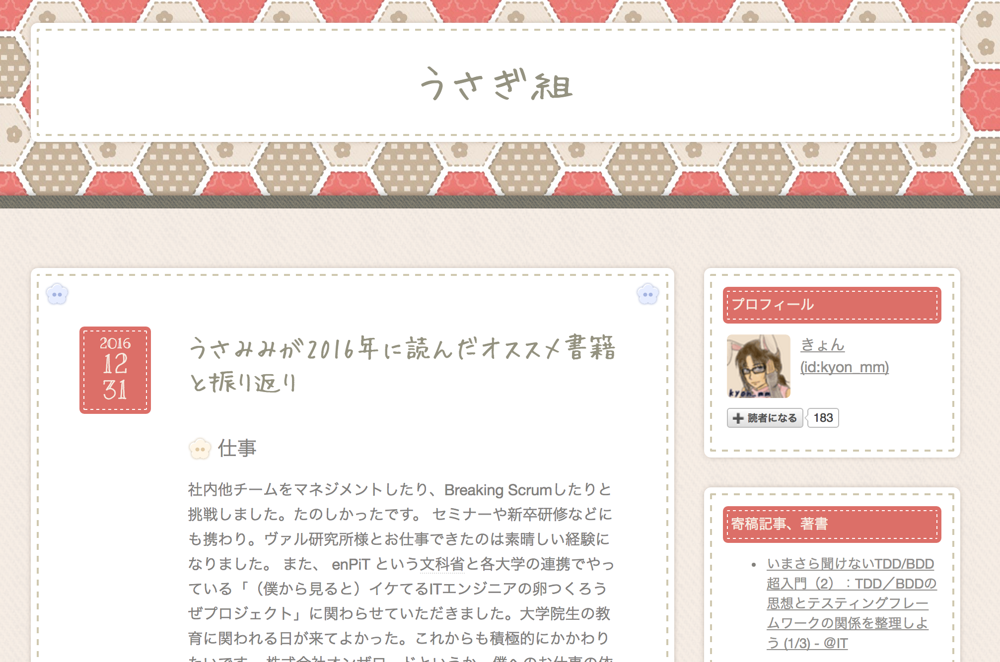

= タイトルをいれます
:Author: kyon_mm
:Email: kyon.mm@gmail.com
:numbered:
ifdef::env-github[]
:tip-caption: :bulb:
:note-caption: :information_source:
:important-caption: :heavy_exclamation_mark:
:caution-caption: :fire:
:warning-caption: :warning:
endif::[]

Asciidocのサンプルです。

== 画像のいれかた

=== 画像をサムネイルでいれる

== テーブル表記

.テーブル例
[%autowidth]
[options="header"]
|===
|Name of Column 1 |Name of Column 2 |Name of Column 3

|Cell in column 1, row 1
|Cell in column 2, row 1
|Cell in column 3, row 1

|Cell in column 1, row 2
|Cell in column 2, row 2
|Cell in column 3, row 2
|===

== リスト
.順序付きリスト
. 親
.. 子供1
... 孫1
.. 子供2

.順序なしリスト
* 親
** 子供1
*** 孫1
** 子供2

== UML例

PlantUmlの利用例です。

.UML Diagram Example
[plantuml,uml-example, svg]
--
abstract class AbstractList
abstract AbstractCollection
interface List
interface Collection

List <|-- AbstractList
Collection <|-- AbstractCollection

Collection <|- List
AbstractCollection <|- AbstractList
AbstractList <|-- ArrayList

class ArrayList {
  Object[] elementData
  size()
}

enum TimeUnit {
  DAYS
  HOURS
  MINUTES
}

annotation SuppressWarnings
--

== 注釈のいれかた

[NOTE]
====
noteです
====

[TIP]
====
tipです
====

[IMPORTANT]
====
importantです
====

[CAUTION]
====
cautionです
====

[WARNING]
====
warningです
====
